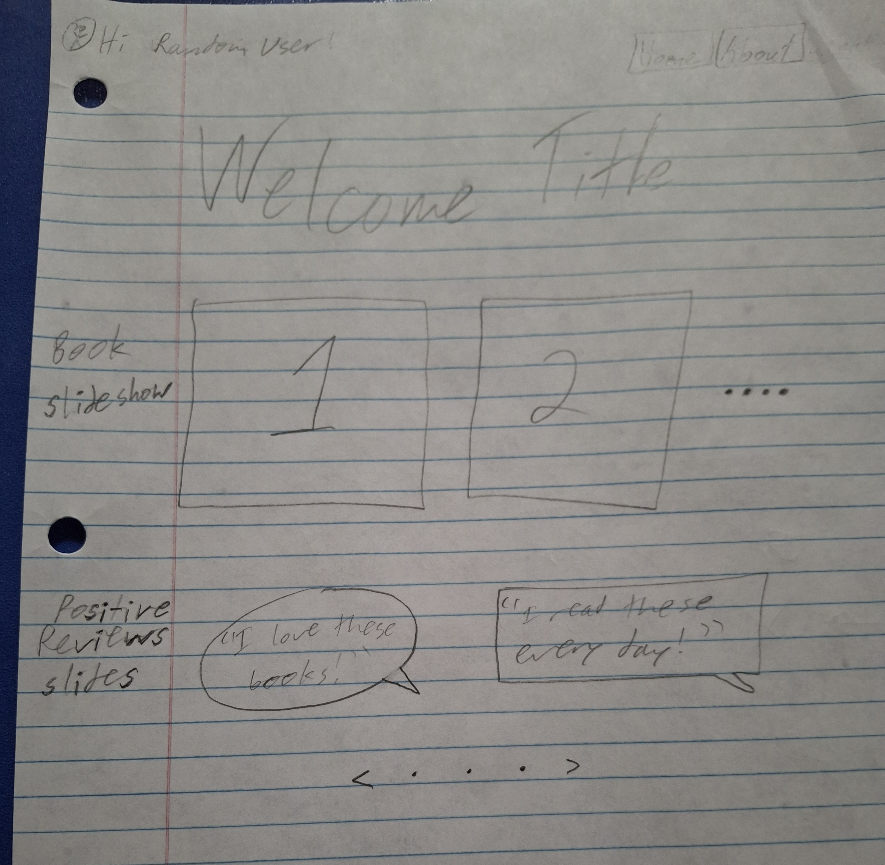
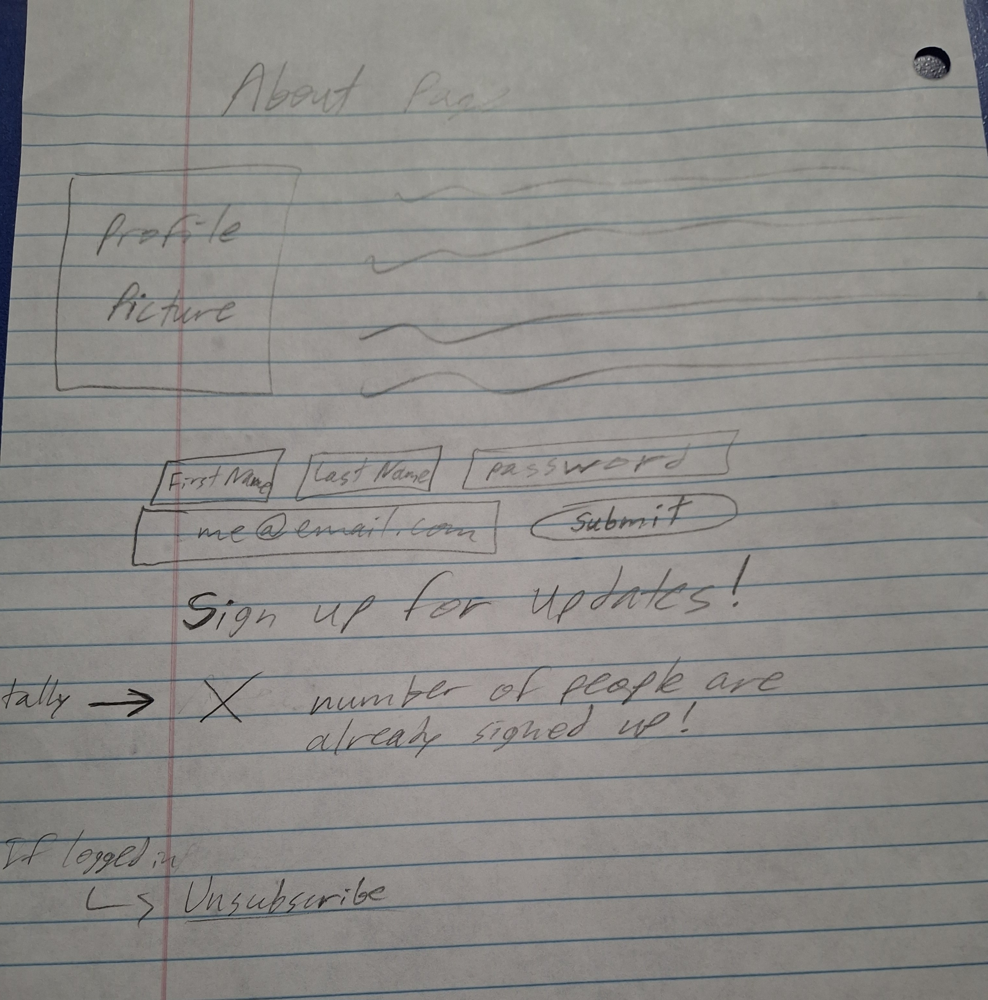
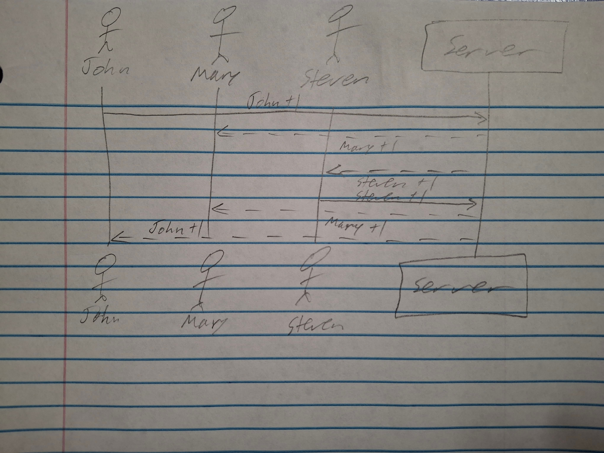

# Author Profile Page

### Elevator pitch

Are you ready for a fresh and inspiring fantasy? Are you eager to find a story that doesn't follow predictable plots found all over your local bookstore? This website shows the best rising author and allows you to see her best selling novels and sign up for exclusive updates of future progress. You also get to see how excited everyone else is by seeing the number of avid fans and their top comments.

Here is the sequence diagram that shows how the subscriber tally is updated.

### Key features

- Secure login over HTTPS
- Display of total subscriber tally updated in realtime
- Ability to interact with book and review slideshows
- User information is stored upon subscription
- User information can be removed if unsubscribed
- Ability for admin to update book and review list

### Technologies

I am going to use the required technologies in the following ways.

- **HTML** - Uses HTML to appropriately format website. 2-3 HTML pages, for the home page, about page, and potentially a sign up page.
- **CSS** - Uses CSS to design the aesthetic and styling of the website. Will be used for a color scheme, sizing, and other features relating to appearance.
- **React/JavaScript** - Uses react for logic relating to user login, submitting information, displaying the subsriber tally, routing and components.
- **Service** - Backend service with endpoints for:
  - login
  - unsubscribing from notification list
  - retrieving total subscriber tally status
- **DB/Login** - Store user profile information in database. Register and login users. Securely stores all sensitive account data in database. Can't unsubrcribe from notifications unless authenticated.
- **WebSocket** - As each user registers, the total subscriber tally increments by one and is updated for all other users

### HTML deliverable

Here are the HTML elements I included for my deliverable.

- [x] **HTML pages** - Three HTML pages that allow users to register, comment, and see more info.
- [x] **Links** - The signup button automatically links to the info page. The nav bar contains links for every page. The unsubscribe button redirects to the main page.
- [x] **Text** - There are textual elements on the about and info pages, as well as user input with the comments section.
- [x] **Images** - I included images on each page and plan on creating a slideshow on the main page.
- [x] **DB/Login** - Input box and submit button for login. Comments and the number of subscribers will also be stored.
- [x] **WebSocket** - There will be a real time updating tally of total subscribers as well as updates for comments from other users.
- [x] **Third Party Service Call** - I included a placeholder for there to be a link which will redirect the user to the default mail feature on their device.

### CSS deliverable

Here are the HTML elements I included for my deliverable.

- [x] **Styling for header, footer, and main content body**
- [x] **Nav elements** - I changed the color, removed underlines, and added a background to the menu bar.
- [x] **Responsive to window resizing** - My app looks great on all window sizes and devices. If the window gets very small, then the header and footer will not be displayed.
- [x] **Application elements** - Separated elements with appropriate whitespace, color changes and horizontal lines.
- [x] **Application text content** - Fonts are all consistent. Some fonts have a different color for contrast.
- [x] **Application images** - Images are sized appropriately

## React deliverable

For this deliverable I fully converted to React and added some Javascript functionality so that the application works for a single user. I maintained placeholders for future features

- [x] **Bundled and transpiled** - finished!
- [x] **Components** - Footer, voting list, vote are all components with mocks for login, WebSocket.
  - [x] **login** - When you press the create button, the username in the top right corner will update.
  - [x] **database** - Displayed the subscriber count. Currently this is hard coded, but it will be replaced with the database data later. There are also input areas for user information.
  - [x] **WebSocket** - I used the setInterval function to periodically increase the subscriber count. This will be replaced with WebSocket messages later.
  - [x] **application logic** - The highlight and ranking number change based up the user's selections.
- [x] **Router** - Routing between info and about components.
- [x] **Hooks** - React uses `UseState` to track changes in the subscriber count.

[Link to notes](https://github.com/graydenhays/startup/blob/main/notes.md)
